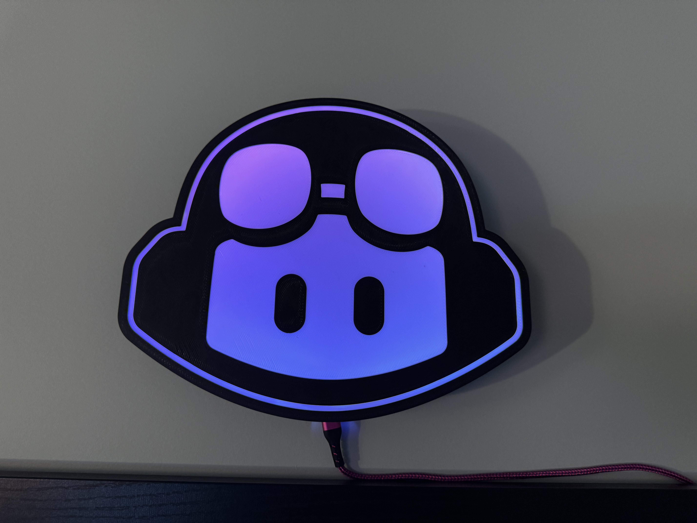

# Copilot Lamp

This is a Copilot lightbox lamp powered by WLED remixed from [Martin's fantastic work here](https://github.com/martinwoodward/octolamp). 

Included are the f3d, step and 3mf files for modifying and printing your own version.

To build the Octolamp, you'll need access to a 3D printer capable of multi color prints such as the BambuLabs X1C, soldering iron and the following components:

- [Black PLA Filament](https://amzn.to/3CTo54W) (for the base) - [[US](https://amzn.to/3CTo54W)] [[UK](https://amzn.to/3w7fCXX)]
- [White PLA Filament](https://amzn.to/3GKObIz) (for the inner body and reflector) - [[US](https://amzn.to/3GKObIz)] [[UK](https://amzn.to/3XBNVSM)]
- WS2812B LED Strip, 60 LEDs per meter, just under 2m worth but usually sold in spools of 5m - [[US](https://amzn.to/3XwWnCT)] [[UK](https://amzn.to/3QKIzm6)]
- ESP8266 NodeMCU D1 Mini Module (or similar clone or other WLED compatible device) - [[US](https://amzn.to/3koQwS0)] [[UK](https://amzn.to/3kmp473)]
- USB lead (Micro or Type-C depending on the model of D1 Mini you have purchased, usually Micro-USB) [[US](https://amzn.to/3CTpqsl)] [[UK](https://amzn.to/3XxulY2)]

### Instructions

The lamp itself is 3 printeable parts, printed in regular pla on 256x256 print bed. The model was printed on a BambuX1C

All models are printed without supports with a 10% infill and are laid out and included in the 3mf file.

- The base is printed in black PLA
- The face is printed in white and black PLA
- The reflector is printed in white PLA

When constructed the pieces should fit together as Base -> Reflector -> Face.

#### Step 1 - Install WLED

First, you'll want to flash your D1 Mini device with [WLED](https://kno.wled.ge/) and then configure it to connect to your WiFi network. the [WLED project](https://kno.wled.ge/) is an open source firmware for many embedded devices that allow you to create beautiful LED displays and network them together. There are controller apps for iOS and Android and it is also fully compatible with the popular [Home Assistant](https://www.home-assistant.io/) software meaning that once built you can control your lamp from anywhere and build any number of automations so that it flashes when someone stars your GitHub repo, changes color when your build breaks or switches on and off with your office lights. 

Note that for large LED displays you can need significant power, you'll also likely want a controller that has a level shifter to send a reliable 5v signal for data to your LED strip. However as we're only powering 100 or so LEDs you can get away with pulling the power and data directly from the pins of an inexpensive D1 Mini.

The quickest and easiest way to install WLED on your D1 Mini is to plug it into the USB socket on your computer and then visit the [WLED web installer site](https://install.wled.me/).

#### Step 2 - Stick the LED Strip to the black base:
The LED Strip should be looped around the inside edge of the base, I was able to wrap around twice for a total of 98 LEDs on the inside edge. The strip should be connected to the D1 Mini

#### Step 3 - Solder the LED strip to the D1 Mini
Rather than use plugs, I soldered my strip directly to my D1 Mini, but you can use connectors if you wish.  Connect the +5v and G lines to the corresponding pins on the D1 Mini and the data line to D4 (just above the +5v and G pins).

#### Step 4 - Place the D1 in the bottom of the base.
I attached the D1 using some double sided tape, but you could use hot glue or similar, be sure to route the USB cable out of the hole in the bottom of the base.

#### Step 5 - Cover with the reflector
Cover the D1 with the reflector and route the LED wire through the notch in the in the refector.

#### Step 6 - Attach the face
The face should be able to press fit onto the base at this point.

#### Step 7 - Power up and configure
Plug in the USB cable and power up the D1 Mini, it should boot into WLED and you should be able to connect to it from your phone or computer and configure the lamp to your liking.
