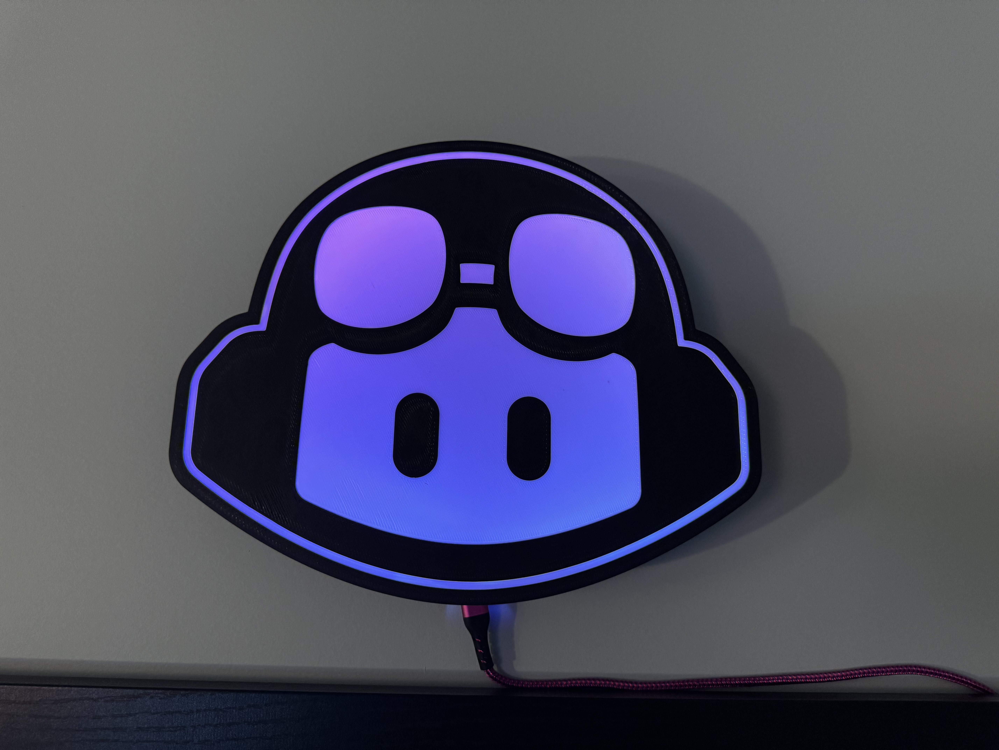

# Copilot Lamp

This is a Copilot lightbox lamp powered by WLED remixed from [Martin's fantastic work here](https://github.com/martinwoodward/octolamp). 

Included are the f3d, step and 3mf files for modifying and printing your own version.

#Bill of Materials
Black PLA
White PLA

Wemos D1

WS2812B LED strip 60Leds/m, approx 2 meters. 

USB-C or Micro USB depending on which model of D1. 

# TODO:
Write rest of readme with build instructions.

